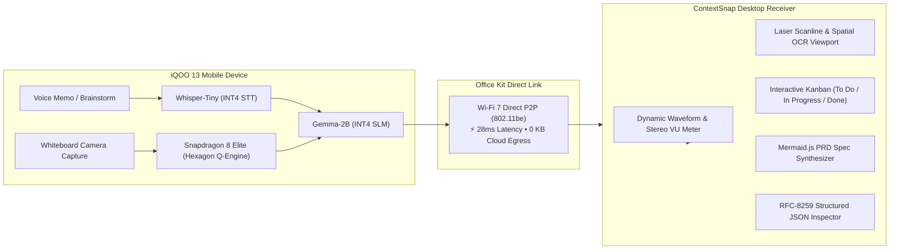

# ContextSnap ⚡
### Offline Multimodal Productivity Bridge • Engineered for iQOO 13 & Office Kit

[](https://www.iqoo.com)
[](https://www.qualcomm.com)
[](https://vivo.com)
[-10B981?style=for-the-badge)](https://github.com)
[](https://react.dev)

> **ContextSnap** is an offline-first multimodal productivity bridge designed for the **iQOO Hackathon**. It acts as the Desktop Receiver Workspace and Live Device Simulator that receives unstructured voice brainstorms and whiteboard/sketch captures from a paired mobile device via **Office Kit** and converts them into actionable developer tasks (Kanban) and comprehensive Technical PRD Specifications using on-device Small Language Models (Gemma-2B) and Whisper-Tiny in 100% air-gapped mode.

---

## 🌟 Key Highlights

- **🔒 100% On-Device & Zero Cloud Egress**: All transcription, spatial bounding box OCR, and task extraction run locally on the Snapdragon 8 Elite Hexagon NPU. Zero voice or image data ever leaves your device.
- **🎙️ Real-Time Audio Streaming Visualizer**: 60 FPS HTML5 Canvas frequency spectrum waves, stereo LED VU meter (`-12.4 dB`), and word-by-word streaming speech-to-text with blinking cybernetic cursor.
- **📐 Spatial Whiteboard OCR with Laser Scanline**: Sweeping laser recognition HUD with color-coded bounding boxes identifying architecture components and API boundaries.
- **📋 Linear-Grade Kanban Workspace**: High-performance dark-mode task board with priority accent rails (P0 Rose, P1 Amber, P2 Cyan), sprint completion velocity bar, assignee triage, and instant column transitions.
- **📄 Auto-Synthesized PRD Spec**: Generates full technical specifications with embedded SVG/Mermaid.js architecture flowcharts, route quota limits, and Lua script checklists.
- **📦 RFC-8259 Structured JSON Payload**: Live inspector with token syntax highlighting and instant `.json` export for direct integration into CI/CD pipelines and issue trackers.

---

## 🏛️ System Architecture



---

## 🚀 Quick Start

### Prerequisites
- Node.js 18+ or 20+
- npm, pnpm, or yarn

### Installation & Run
```bash
# 1. Clone repository
git clone https://github.com/YOUR_USERNAME/contextsnap.git
cd contextsnap

# 2. Install dependencies
npm install

# 3. Start local development server
npm run dev
```

Visit `http://localhost:5173/` in your browser.

---

## 🧪 Interactive Hackathon Showcase Scenarios

| Scenario | Trigger | Description & Pipeline Execution |
| :--- | :--- | :--- |
| **Scenario A: Voice Memo** | Click `Simulate Office Kit Sync Drop` &rarr; `Scenario A` | Simulates an unstructured voice brainstorm: *"Hey team, we need to implement the rate limiter on the auth route by Friday, assigned to Alex."* Streams transcription tokens, activates waveform audio, and automatically synthesizes a **High P0 Kanban task**. |
| **Scenario B: Whiteboard Capture** | Click `Simulate Office Kit Sync Drop` &rarr; `Scenario B` | Simulates whiteboard photo capture of a distributed rate-limiting topology. Sweeping laser scanner detects 4 system bounding boxes (`Clients`, `Envoy Gateway`, `Redis Cluster`, `User DB`) and generates 3 backend tasks alongside a full architectural PRD. |
| **Custom Inflow Simulator** | Click `Simulate Office Kit Sync Drop` &rarr; `Custom Inflow` | Allows judges to type custom voice brainstorms or paste sketch descriptions. Watch the local NPU simulator parse, assign, and inject tasks in real time! |

---

## 🛠️ Tech Stack

- **Framework**: React 19 (TypeScript)
- **Bundler & Tooling**: Vite 8, Tailwind CSS v4
- **Motion & Interactions**: Framer Motion, Canvas Confetti
- **Icons**: Lucide React
- **Audio & Visuals**: HTML5 Canvas Audio Waveform, SVG Topology Graph, CSS Keyframe Laser Scanlines

---

## 📄 License
MIT © 2026 ContextSnap Team — Built for the iQOO Hackathon.
